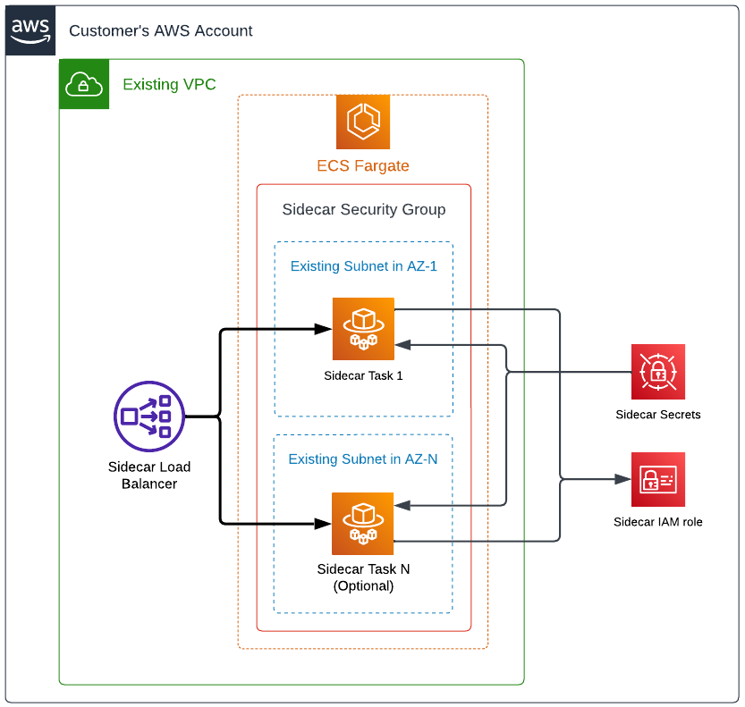

# Sidecar - Terraform AWS ECS

A quick start to deploy a sidecar to AWS EC2 using Terraform!

This guide explains how to deploy a basic sidecar on AWS using ECS.
This example provides only the necessary configuration to
deploy a sidecar container. For more details, please read the
[Cyral DIY Deployment](https://cyral.com/docs/sidecars/deployment/#custom-deployment-diy)
documentation.

By following the steps of this guide, you will deploy a sidecar to ECS.

> [!NOTE]
> If you prefer to deploy a sidecar to AWS EC2 instead, see
> our [Terraform AWS EC2 Quickstart](https://github.com/cyralinc/terraform-aws-sidecar-ec2).

---

## Architecture



---

## Deployment

The elements shown in the architecture diagram above are deployed by this module and it requires existing VPC and subnets in order to create the necessary components for the sidecar to run. In a high-level, these are the resources deployed:

* ECS
    * Cluster (optional)
    * Services
    * Task definitions
* EC2
    * Network load balancer
    * Security group
* Systems Manager Parameter Store
    * Sidecar credentials
* IAM
    * Sidecar role

### Requirements

* Make sure you have access to your AWS environment with an account that has sufficient permissions to deploy the sidecar. The minimum permissions must allow for the creation of the elements listed previously. We recommend Administrator permissions (`AdministratorAccess` policy) as the module creates an IAM role.
* Decide your certificate deployment type. Refer to the [Sidecar certificates](./docs/certificates.md) document for additional guidance.

### Examples

#### Quick Start

* Save the code below in a `.tf` file (ex `sidecar.tf`) in a new folder.
    * Fill the parameters `sidecar_id`, `control_plane`, `client_id` and 
    `client_secret` with the information from the `Cyral Templates` option
    in the `Deployment` tab of your sidecar details.
    * Fill the parameters `vpc_id` and `subnets` with an existing VPC and subnets that allows 
    network connectivity to the Cyral control plane (outbound HTTPS and gRPC traffic using port `443`)
    and to the database you plan to protect with this sidecar.

* Open a command line terminal in the new folder.
* Configure the AWS CLI credentials or provide them through environment variables.
* Run `terraform init` followed by `terraform apply`.

```hcl
provider "aws" {
  # Define the target AWS region
  region = "us-east-1"
}

module "cyral_sidecar" {
  source = "github.com/cyral-quickstart/quickstart-sidecar-terraform-aws-ecs?ref=v1.0.1"

  # Assign the version that will be used by the sidecar instances.
  sidecar_version = ""

  sidecar_id    = ""
  control_plane = ""
  client_id     = ""
  client_secret = ""

  # The ports that the sidecar will allow for incoming connections.
  # If planning to use more than 5 ports, please read the
  # `Advanced networking configuration` section of this document
  # carefully.
  sidecar_ports = [
    3306, 5432
  ]
  vpc_id  = "<vpc-id>"
  subnets = ["<subnet-id>"]

  #############################################################
  #                       DANGER ZONE
  # The following parameters will expose your sidecar to the
  # internet. This is a quick set up to test with databases
  # containing dummy data. Never use this configuration if you
  # are binding your sidecar to a database that contains any
  # production/real data unless you understand all the
  # implications and risks involved.

  # If you provided private subnets, set this to `false`
  ecs_assign_public_ip = true
  load_balancer_scheme = "internet-facing"

  # Unrestricted inbound to ports defined in `sidecar_ports`
  db_inbound_cidr         = ["0.0.0.0/0"]
  # Unrestricted inbound to monitor ECS instances (port 9000)
  monitoring_inbound_cidr = ["0.0.0.0/0"]
  #############################################################
}
```

#### Production Starting Point


* Save the code below in a `.tf` file (ex `sidecar.tf`) in a new folder.
    * Fill the parameters `sidecar_id`, `control_plane`, `client_id` and 
    `client_secret` with the information from the `Cyral Templates` option
    in the `Deployment` tab of your sidecar details.
    * Fill the parameters `vpc_id` and `subnets` with an existing VPC and subnets that allows 
    network connectivity to the Cyral control plane (outbound HTTPS and gRPC traffic using port `443`)
    and to the database you plan to protect with this sidecar.

* Open a command line terminal in the new folder.
* Configure the AWS CLI credentials or provide them through environment variables.
* Run `terraform init` followed by `terraform apply`.

```hcl
provider "aws" {
  # Define the target AWS region
  region = "us-east-1"
}

module "cyral_sidecar" {
  source = "github.com/cyral-quickstart/quickstart-sidecar-terraform-aws-ecs?ref=v1.0.1"

  # Assign the version that will be used by the sidecar instances.
  sidecar_version = ""

  sidecar_id    = ""
  control_plane = ""
  client_id     = ""
  client_secret = ""

  # The ports that the sidecar will allow for incoming connections.
  # If planning to use more than 5 ports, please read the
  # `Advanced networking configuration` section of this document
  # carefully.
  sidecar_ports = [
    3306, 5432
  ]
  vpc_id  = "<vpc-id>"
  # For production use cases, provide multiple subnets in
  # different availability zones.
  subnets = [
    "<subnet-az1-id>",
    "<subnet-az2-id>",
    "<subnet-azN-id>"
  ]
  # Provide a number that is equal to or greater than the number
  # of AZs provided in `subnets` to instantiate tasks in all AZs.
  ecs_service_desired_count = N

  ecs_assign_public_ip = false
  load_balancer_scheme = "internal"

  # Unrestricted inbound to ports defined in `sidecar_ports`
  db_inbound_cidr         = ["0.0.0.0/0"]
  # Unrestricted inbound to monitor ECS instances (port 9000)
  monitoring_inbound_cidr = ["0.0.0.0/0"]
}
```

The example above will create a production-grade configuration and assumes you understand
the basic concepts of a Cyral sidecar.

For a production configuration, we recommend that you provide multiple subnets in different
availability zones and properly assess the dimensions and number of ECS instances required
for your production workload.

In order to properly secure your sidecar, define appropriate inbound CIDRs using variables
`db_inbound_cidr` and `monitoring_inbound_cidr` or define inbound

In case the databases you are protecting with the Cyral sidecar also live on AWS, make sure to
add the sidecar security group (see output parameter `security_group_id`) to the list of
allowed inbound rules in the databases' security groups. If the databases do not live on AWS,
analyze what is the proper networking configuration to allow connectivity from the ECS
instances to the protected databases.

---

## Upgrade

To upgrade your sidecar, update the parameter `sidecar_version`
with the target version and run `terraform apply`.

Learn more in the [sidecar upgrade procedures](https://cyral.com/docs/sidecars/manage/upgrade/) page.

---

## Advanced

Instructions for advanced configurations are available for the following topics:

* [Advanced networking configuration](./docs/networking.md)
